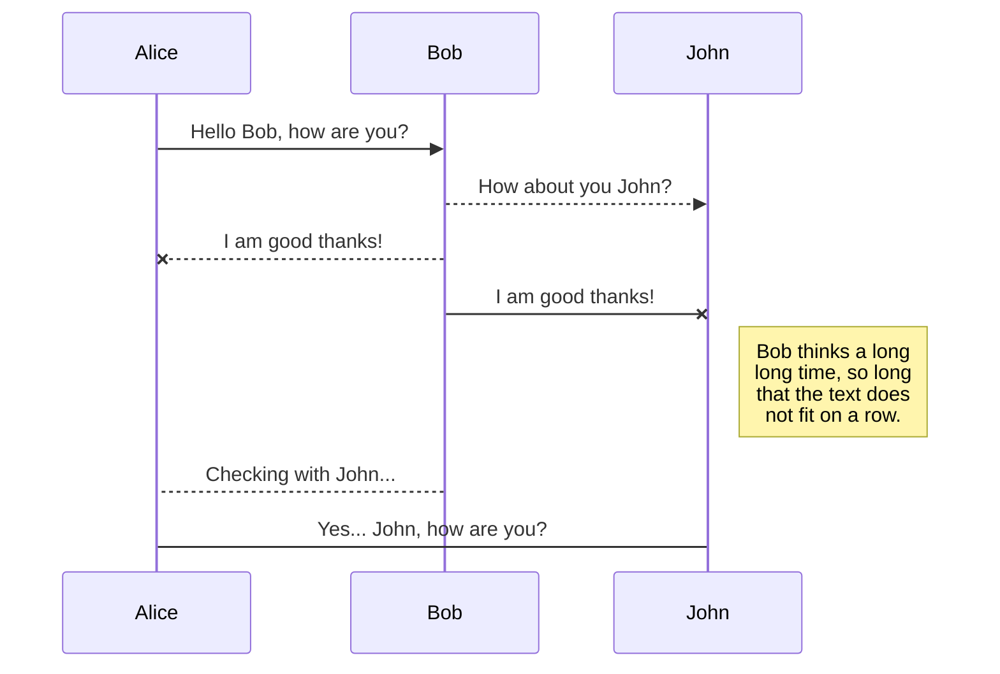

<link rel="icon" href="favicon.png" type="image/png" />
<meta name="viewport" content="width=device-width, initial-scale=1.0">

# This is a TITLE  --1

## This is a Sub-Title --2

### This is a SubSubTitle ;) --3
#### This is a SubSubSubTitle ^^ --4
##### And This is a SubSubSubSubTitle ... 5!
###### This a SubSubSubSubSubSubTitle ... 6 This is the last !!!
This is some text and such...

- **bold**
- *italic*
  + 2.1 


# Video

## Video on Youtube:

<iframe width="600" height="337" src="https://www.youtube.com/embed/fNJf7yPhpJs" frameborder="0" allow="accelerometer; autoplay; encrypted-media; gyroscope; picture-in-picture" allowfullscreen></iframe>

Code:

```html
  <iframe src="https://www.youtube.com/embed/fNJf7yPhpJs" allowfullscreen="yes" class="iframe" scrolling="no" frameborder="0"></iframe>
```

# Text Formating
## Checkbox
- [x] Done => ``[x] Done``
- [ ] Not yet done => ``[ ] Not yet done``

## Some ``CODE`` Examples
Some **BASH**:
```bash
#!/bin/bash
# This is some bash
echo "Hello world ^^"
```

Some **Python**:
```python
print("This is some Python code")

choice = str(input(print("Voulez-vous continuer? (Y/n")))

if choice == (Y | y):
  print("Vous avez choisi de continuer !!! ")
elif choice == (N | n):
  print("Vous avez choisi d'abandonner... ")
else:
  print("Mauvaise réponse, Erreur. Mauvaise réponse, Erreur. Mauvaise réponse, Erreur. Mauvaise réponse, Erreur. Mauvaise réponse, Erreur. Mauvaise réponse, Erreur. Mauvaise réponse, Erreur. Mauvaise réponse, Erreur. Mauvaise réponse, Erreur. Mauvaise réponse, Erreur. Mauvaise réponse, Erreur. Mauvaise réponse, Erreur. Mauvaise réponse, Erreur. Mauvaise réponse, Erreur. Mauvaise réponse, Erreur. Mauvaise réponse, Erreur. Mauvaise réponse, Erreur. Mauvaise réponse, Erreur. Mauvaise réponse, Erreur. Mauvaise réponse, Erreur. ")
```

<!-- Page Break -->
\newpage

## Nouvelle Page (PDF)
Nouvelle page créée avec la commande: ``\newpage`` *(latex)* \
Example de *LATEX*:

```latex
\documentclass{article}
\usepackage{comment}

% uncomment to include stuff in standard comment-environment
%\includecomment{comment}

% define a mysection env which content is excluded
\excludecomment{mysection}

\begin{document}
    This text will be displayed
\begin{comment}
    This text will only be displayed, if \includecomment{comment} was given
\end{comment}
\begin{mysection}
    This text will only be displayed, if \includecomment{mysection} was given
\end{mysection}
\end{document}
```

## Callouts
Callouts can be **SUPER** *useful*:

<p class="info"> This is just some information</p>
```html
<p class="info"> This is just some information</p>
```
<p class="success"> This is a SUCCESS !</p>
```html
<p class="success"> This is a SUCCESS !</p>
```
<p class="warning"> This is a WARNING !</p>
```html
<p class="warning"> This is a WARNING !</p>
```
<p class="alert"> This is an ALERT !!! </p>
```html
<p class="alert"> This is an ALERT !!! </p>
```

Consult ``styleDark.css`` and modify the color scheme using: [https://www.w3schools.com/colors/colors_picker.asp](https://www.w3schools.com/colors/colors_picker.asp)

## Questions & Answers

<p class='question'> Is this a question ???</p>
```html
<p class='question'> Is this a question ???</p>
```
<p class='answer'> Yes it is ! *(This is an answer)* </p>
```html
<p class='answer'> Yes it is ! *(This is an answer)* </p>
```

Example:

<p class="question"> What was that thing that Lemony Snicket said ? </p>
<p class="answer"> “Life is a conundrum of esoterica.”  </p>


## Links
You can make links with the ``<...>``
like so: <https://davidchdebray.github.io/>

## Notes
By the way, the theme can be changed from **Light** to **Dark**. ;)
To do it simply change ```styleLight.css``` to ```styleDark.css``` and **Done!**

## Quotes
To quote something use: ``">"``\
Like so:

> In 2002, after the Men of the Machine killed his wife, Patrick Spring, who was a fake identity created to be the son of Edgar Spring, who is actually Zachariah Webb, jumped forward in time to last week, destroyed the Men of the Machine, and then went to the Perriman Grand to confront his future self, which led to the young Patrick Spring accidentally killing old Patrick Spring when a kitten went off and set off a shark explosion.
>  
> -- <cite> [Todd, Dirk Gently's Holistic Detective Agency][1]</cite>

[1]:https://www.imdb.com/title/tt4047038/


<blockquote>
  Tragedy is when I cut my finger. Comedy is when you walk into an open sewer and die.
</blockquote>

# Mathematics
To write an equation, we use the double-dollar signs: ``$$...$$`', like so:

## Pythagore:
$$ a^2 + b^2 = c^2 $$

## Enstein:
$$ E = mc/exp2 $$

## Other Equations

$$\int_0^1 f(t) \mathrm{d}t$$

$$\sum_j \gamma_j^2/d_j$$


The *Gamma function* satisfying $\Gamma(n) = (n-1)!\quad\forall n\in\mathbb N$ is via the Euler integral

$$
\Gamma(z) = \int_0^\infty t^{z-1}e^{-t}dt\,.
$$


For more: [Writing Mathematic Fomulars in Markdown ](https://csrgxtu.github.io/2015/03/20/Writing-Mathematic-Fomulars-in-Markdown/)

# Workflow

## UML
With **Mermaid**:



# Data Collections
## Tables
|                |ASCII                          |HTML                         |
|----------------|-------------------------------|-----------------------------|
|Single backticks|`'Isn't this fun?'`            |'Isn't this fun?'            |
|Quotes          |`"Isn't this fun?"`            |"Isn't this fun?"            |
|Dashes          |`-- is en-dash, --- is em-dash`|-- is en-dash, --- is em-dash|


---

<p style="text-align: center"> [Template - Version PDF](template.pdf) </p>

---

